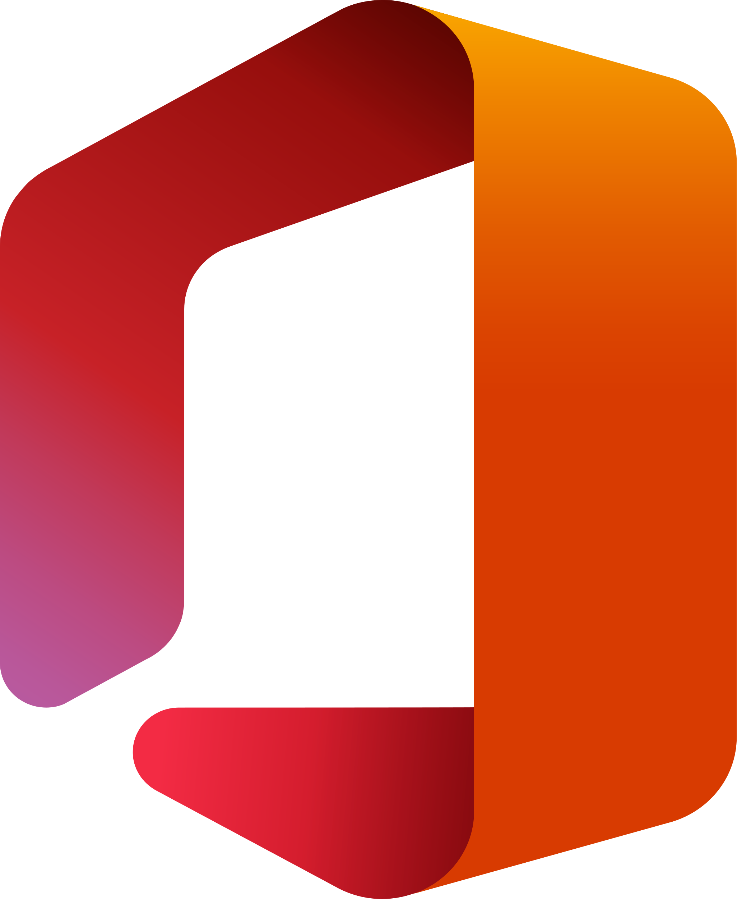
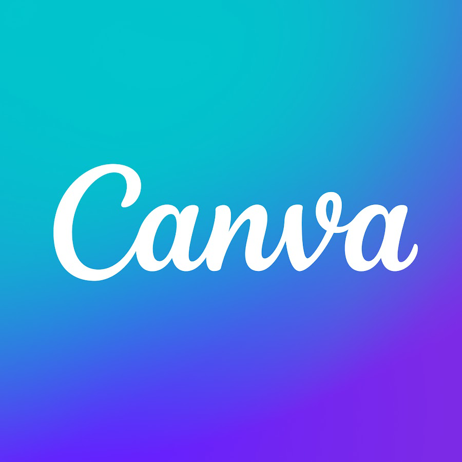
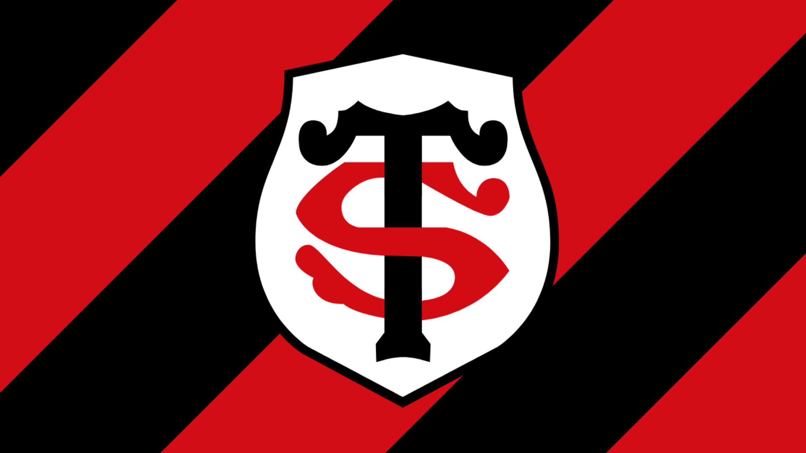
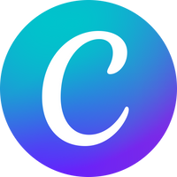

# Composants extraits du portfolio - Sami BENDRISS

Extraction de 7 composants individuels (HTML + CSS) depuis le portfolio.
Toutes les variables CSS ont été remplacées par leurs valeurs brutes.

---

## 1. Composant "Réseaux sociaux" (Mes compétences)

> Source : `about.html` lignes 163-178

### HTML

```html
<!-- 5) Réseaux sociaux -->
<div class="software-card skill-card">
    <div class="skill-icon">
        <!-- Partage -->
        <svg viewBox="0 0 24 24" fill="none" stroke="currentColor" stroke-width="2">
            <circle cx="18" cy="5" r="3"></circle>
            <circle cx="6" cy="12" r="3"></circle>
            <circle cx="18" cy="19" r="3"></circle>
            <path d="M8.59 13.51 15.42 17.49M15.41 6.51 8.59 10.49"></path>
        </svg>
    </div>
    <div class="skill-content">
        <h3 class="skill-name">Réseaux sociaux</h3>
        <p class="software-description">Stratégie, community management, analyse de la performance</p>
    </div>
</div>
```

### CSS

```css
/* === Section compétences (thème rouge) === */
.skills-section {
    margin-bottom: 80px;
}

.skills-section .software-card:hover {
    border-color: #DC2626;
    box-shadow: 0 10px 30px rgba(220, 38, 38, 0.4);
}

.skills-section .skill-card:hover .skill-icon {
    background: rgba(220, 38, 38, 0.4);
}

.skills-grid {
    display: grid;
    grid-template-columns: repeat(auto-fit, minmax(250px, 1fr));
    gap: 30px;
}

/* === Base .software-card (partagée par compétences et logiciels) === */
.software-card {
    background: rgba(220, 38, 38, 0.1);
    padding: 18px;
    border-radius: 20px;
    backdrop-filter: blur(10px);
    border: 1px solid rgba(255, 255, 255, 0.1);
    transition: all 0.3s ease;
    opacity: 0;
    animation: fadeInUp 0.6s ease forwards;
    animation-delay: calc(var(--index) * 0.1s);
    display: flex;
    align-items: center;
    gap: 20px;
}

@keyframes fadeInUp {
    from { opacity: 0; transform: translateY(30px); }
    to   { opacity: 1; transform: translateY(0); }
}

/* === Spécifique skill-card === */
.skill-card .skill-icon {
    width: 75px;
    height: 75px;
    min-width: 75px;
    background: rgba(220, 38, 38, 0.1);
    border-radius: 12px;
    display: flex;
    align-items: center;
    justify-content: center;
    padding: 10px;
    overflow: hidden;
    transition: all .3s ease;
}

.skill-card .skill-icon svg {
    width: 80%;
    height: 80%;
    stroke: #000000;
}

.skill-card:hover .skill-icon {
    background: rgba(220, 38, 38, 0.4);
    transform: scale(1.1);
}

.skill-name {
    font-size: 1.2rem;
    font-weight: 700;
    margin-bottom: 8px;
}

.software-description {
    font-size: 0.9rem;
    color: #6a6a6a;
    margin: 0;
}

.software-card:hover .skill-name,
.software-card:hover .software-description {
    color: #DC2626;
}
```

---

## 2. Composant "Pack Office" (Mes logiciels)

> Source : `about.html` lignes 304-348

### HTML

```html
<!-- Pack Office - 4.5/5 étoiles -->
<div class="software-card" style="--index: 1">
    <div class="software-logo">
        
    </div>
    <div class="software-content">
        <h3 class="software-name">Pack Office</h3>
        <div class="software-level">
            <!-- 4 étoiles pleines -->
            <svg class="star" width="16" height="16" viewBox="0 0 24 24" fill="currentColor">
                <path d="M12 2l3.09 6.26L22 9.27l-5 4.87 1.18 6.88L12 17.77l-6.18 3.25L7 14.14 2 9.27l6.91-1.01L12 2z" />
            </svg>
            <svg class="star" width="16" height="16" viewBox="0 0 24 24" fill="currentColor">
                <path d="M12 2l3.09 6.26L22 9.27l-5 4.87 1.18 6.88L12 17.77l-6.18 3.25L7 14.14 2 9.27l6.91-1.01L12 2z" />
            </svg>
            <svg class="star" width="16" height="16" viewBox="0 0 24 24" fill="currentColor">
                <path d="M12 2l3.09 6.26L22 9.27l-5 4.87 1.18 6.88L12 17.77l-6.18 3.25L7 14.14 2 9.27l6.91-1.01L12 2z" />
            </svg>
            <svg class="star" width="16" height="16" viewBox="0 0 24 24" fill="currentColor">
                <path d="M12 2l3.09 6.26L22 9.27l-5 4.87 1.18 6.88L12 17.77l-6.18 3.25L7 14.14 2 9.27l6.91-1.01L12 2z" />
            </svg>
            <!-- Demi-étoile -->
            <svg class="star half" width="16" height="16" viewBox="0 0 24 24">
                <defs>
                    <clipPath id="half-star-clip">
                        <rect x="0" y="0" width="12" height="24" />
                    </clipPath>
                </defs>
                <path d="M12 2l3.09 6.26L22 9.27l-5 4.87 1.18 6.88L12 17.77l-6.18 3.25L7 14.14 2 9.27l6.91-1.01L12 2z"
                    fill="none" stroke="#FBC821" stroke-width="2" opacity="0.3" />
                <path d="M12 2l3.09 6.26L22 9.27l-5 4.87 1.18 6.88L12 17.77l-6.18 3.25L7 14.14 2 9.27l6.91-1.01L12 2z"
                    fill="currentColor" clip-path="url(#half-star-clip)" />
            </svg>
        </div>
        <p class="software-description">Word, PowerPoint, Excel</p>
    </div>
</div>
```

### CSS

```css
/* === Section logiciels (thème bleu) === */
.softwares-section {
    margin-bottom: 80px;
}

.softwares-section .software-card:hover .software-logo {
    background: rgba(59, 130, 246, 0.40);
}

.softwares-grid {
    display: grid;
    grid-template-columns: repeat(auto-fit, minmax(250px, 1fr));
    gap: 30px;
}

/* === Base .software-card (commune) === */
.software-card {
    background: rgba(59, 130, 246, 0.1);
    padding: 18px;
    border-radius: 20px;
    backdrop-filter: blur(10px);
    border: 1px solid rgba(255, 255, 255, 0.1);
    transition: all 0.3s ease;
    opacity: 0;
    animation: fadeInUp 0.6s ease forwards;
    animation-delay: calc(var(--index) * 0.1s);
    display: flex;
    align-items: center;
    gap: 20px;
}

.software-card:hover {
    transform: translateY(-5px);
    background: rgba(59, 130, 246, 0.15);
    border-color: #3B82F6;
    box-shadow: 0 10px 30px rgba(59, 130, 246, 0.4);
}

/* === Logo === */
.software-logo {
    width: 75px;
    height: 75px;
    min-width: 75px;
    background: rgba(59, 130, 246, 0.1);
    border-radius: 12px;
    display: flex;
    align-items: center;
    justify-content: center;
    padding: 10px;
    transition: all 0.3s ease;
    overflow: hidden;
}

.software-logo img {
    width: 100%;
    height: 100%;
    object-fit: contain;
    opacity: 0.8;
    transition: all 0.3s ease;
}

.software-card:hover .software-logo {
    background: rgba(59, 130, 246, 0.4);
    transform: scale(1.1);
}

.software-card:hover .software-logo img {
    opacity: 1;
}

/* === Contenu texte === */
.software-name {
    font-size: 1.2rem;
    font-weight: bold;
    margin-bottom: 8px;
}

.software-card:hover .software-name,
.software-card:hover .software-description {
    color: #3B82F6;
}

.software-level {
    display: flex;
    gap: 3px;
    align-items: center;
    margin-bottom: 10px;
}

.software-description {
    font-size: 0.9rem;
    color: #6a6a6a;
    margin: 0;
}

/* === Étoiles === */
.star {
    width: 20px;
    height: 20px;
    color: #FFFAB6;
    stroke: #FBC821;
    stroke-width: 1.5;
}

.star.half {
    color: #FFFAB6;
    stroke: #FBC821;
    position: relative;
}

.star.empty {
    opacity: 0.3;
    fill: none;
    stroke: #FBC821;
    stroke-width: 2;
}
```

---

## 3. Composant "Canva" (Mes logiciels)

> Source : `about.html` lignes 350-382

### HTML

```html
<!-- Canva - 4/5 étoiles -->
<div class="software-card" style="--index: 2">
    <div class="software-logo no-padding">
        
    </div>
    <div class="software-content">
        <h3 class="software-name">Canva</h3>
        <div class="software-level">
            <svg class="star" width="16" height="16" viewBox="0 0 24 24" fill="currentColor">
                <path d="M12 2l3.09 6.26L22 9.27l-5 4.87 1.18 6.88L12 17.77l-6.18 3.25L7 14.14 2 9.27l6.91-1.01L12 2z" />
            </svg>
            <svg class="star" width="16" height="16" viewBox="0 0 24 24" fill="currentColor">
                <path d="M12 2l3.09 6.26L22 9.27l-5 4.87 1.18 6.88L12 17.77l-6.18 3.25L7 14.14 2 9.27l6.91-1.01L12 2z" />
            </svg>
            <svg class="star" width="16" height="16" viewBox="0 0 24 24" fill="currentColor">
                <path d="M12 2l3.09 6.26L22 9.27l-5 4.87 1.18 6.88L12 17.77l-6.18 3.25L7 14.14 2 9.27l6.91-1.01L12 2z" />
            </svg>
            <svg class="star" width="16" height="16" viewBox="0 0 24 24" fill="currentColor">
                <path d="M12 2l3.09 6.26L22 9.27l-5 4.87 1.18 6.88L12 17.77l-6.18 3.25L7 14.14 2 9.27l6.91-1.01L12 2z" />
            </svg>
            <svg class="star empty" width="16" height="16" viewBox="0 0 24 24" fill="none"
                stroke="currentColor" stroke-width="2">
                <path d="M12 2l3.09 6.26L22 9.27l-5 4.87 1.18 6.88L12 17.77l-6.18 3.25L7 14.14 2 9.27l6.91-1.01L12 2z" />
            </svg>
        </div>
        <p class="software-description">Création de visuels</p>
    </div>
</div>
```

### CSS

> Mêmes styles que le composant "Pack Office" ci-dessus (`.software-card`, `.software-logo`, `.star`, etc.).
>
> Seules différences :
> - La classe `.logo-full` et `.no-padding` sur le logo.

```css
/* Logo plein cadre (sans padding) */
.logo-full {
    width: 100% !important;
    height: 100% !important;
    object-fit: cover !important;
    padding: 0 !important;
}

.software-logo:has(.logo-full) {
    padding: 0;
    overflow: hidden;
}
```

---

## 4. Composant "Paris SO Cœur" (Expériences professionnelles)

> Source : `experience.html` lignes 119-155

### HTML

```html
<div class="timeline-item" style="--index: 1">
    <div class="timeline-content">
        <div class="timeline-icon timeline-icon-svg">
            <svg width="20" height="20" viewBox="0 0 24 24" fill="none" stroke="currentColor"
                stroke-width="2" stroke-linecap="round" stroke-linejoin="round">
                <circle cx="12" cy="12" r="10"></circle>
                <circle cx="12" cy="12" r="3"></circle>
            </svg>
        </div>
        <div class="timeline-header">
            <div class="timeline-logo">
                
            </div>
            <div class="timeline-info">
                <p class="timeline-date">Mai 2025 - Juin 2025
                    <span class="date-badge">2 mois</span></p>
                <h3 class="timeline-title">Assistant Chargé de communication</h3>
                <p class="timeline-company"><b>
                    <mark class="red">Paris SO Cœur</mark> |
                        Issy-les-Moulineaux</b></p>
            </div>
        </div>
        <p class="timeline-description"></p>
        <ul class="timeline-list">
            <li>Réalisation d'une veille concurrentielle des clubs féminins et autres
                organisations sportives.</li>
            <li>Gestion des réseaux sociaux et création de contenus digitaux et presse pour un
                <b><span style="color: #DC2626;">club de football 100% féminin</span></b>.</li>
            <li>Accompagnement du rebranding du club vers <b><span style="color: #DC2626;">
                "Paris SO Cœur" (anciennement "GPSO 92 Issy")</span></b> et adaptation de la
                stratégie de communication.</li>
        </ul>
    </div>
</div>
```

### CSS

```css
mark {
    background-color: #3B82F6;
    color: #FFFFFF;
    font-weight: bold;
    padding: 0.1em 0.2em;
    border-radius: 4px;
}

mark.red {
    background-color: #DC2626;
}

/* === Section timeline === */
.timeline-section {
    position: relative;
}

.timeline {
    position: relative;
    padding: 40px 0;
    padding-top: 0;
}

/* Ligne verticale */
.timeline::before {
    content: '';
    position: absolute;
    left: 30px;
    top: 0;
    bottom: 30px;
    width: 2px;
    background: #000000;
    transform: translateX(-50%);
}

body.dark-mode .timeline::before {
    background: #FFFFFF;
}

/* === Item === */
.timeline-item {
    margin-bottom: 50px;
    width: calc(100% - 50px);
    margin-left: 30px;
    padding-left: 40px;
    padding-right: 0;
    justify-content: flex-start;
}

.timeline-item:last-child {
    margin-bottom: 0;
}

/* === Contenu (carte) === */
.timeline-content {
    background: rgba(59, 130, 246, 0.1);
    padding: 25px;
    border-radius: 20px;
    backdrop-filter: blur(10px);
    border: 1px solid rgba(0, 0, 0, 0.1);
    position: relative;
    max-width: none;
    transition: all 0.3s ease;
}

.timeline-content:hover {
    transform: scale(1.02);
    border-color: #3B82F6;
    box-shadow: 0 10px 30px rgba(59, 130, 246, 0.4);
}

/* === Header (logo + info) === */
.timeline-header {
    display: flex;
    align-items: flex-start;
    gap: 15px;
    margin-bottom: 15px;
}

/* === Logo === */
.timeline-logo {
    width: 75px;
    height: 75px;
    min-width: 75px;
    background: rgba(59, 130, 246, 0.1);
    border-radius: 12px;
    display: flex;
    align-items: center;
    justify-content: center;
    padding: 10px;
    transition: all 0.3s ease;
    overflow: hidden;
}

.timeline-logo img {
    width: 100%;
    height: 100%;
    object-fit: contain;
    opacity: 1;
    transition: all 0.3s ease;
}

.logo-full {
    width: 100% !important;
    height: 100% !important;
    object-fit: cover !important;
    padding: 0 !important;
}

.timeline-logo:has(.logo-full) {
    padding: 0;
    overflow: hidden;
}

.logo-full.logo-reduced {
    width: 85% !important;
    height: 85% !important;
    margin: auto;
}

.timeline-content:hover .timeline-logo {
    background: rgba(59, 130, 246, 0.4);
    transform: scale(1.05);
}

.timeline-content:hover .timeline-logo img {
    opacity: 1;
}

/* === Icône timeline (pastille ronde) === */
.timeline-icon {
    position: absolute;
    top: 50%;
    left: -62px;
    right: auto;
    width: 40px;
    height: 40px;
    background: linear-gradient(135deg, #3B82F6 0%, #8B5CF6 100%);
    border-radius: 50%;
    display: flex;
    align-items: center;
    justify-content: center;
    font-size: 1.2rem;
    box-shadow: 0 0 0 4px #FFFFFF;
    z-index: 1;
}

.timeline-item .timeline-icon {
    top: calc(50% - 15px);
}

.timeline-icon svg {
    display: none;
}

.timeline-icon-svg {
    background: #0a0a0a !important;
    color: #FFFFFF;
    box-shadow: 0 0 0 4px #FFFFFF;
    transition: all 0.3s ease;
}

.timeline-icon-svg svg {
    width: 20px;
    height: 20px;
    stroke: #0a0a0a;
}

body.dark-mode .timeline-icon-svg {
    background: #FFFFFF !important;
    color: #0a0a0a;
    box-shadow: 0 0 0 4px #0a0a0a;
}

body.dark-mode .timeline-icon-svg svg {
    stroke: #0a0a0a;
}

/* === Textes === */
.timeline-info {
    flex: 1;
}

.timeline-date {
    color: #000000;
    font-weight: bold;
    margin-bottom: 5px;
}

.timeline-title {
    font-size: 1.2rem;
    font-weight: bold;
    margin-bottom: 5px;
    color: #3B82F6;
}

.timeline-company {
    color: #6a6a6a;
    margin-bottom: 0;
}

.timeline-description {
    line-height: 1.5;
    color: #000000;
    margin-top: 0;
    margin-bottom: 0;
}

.timeline-description+.timeline-list {
    margin-top: 10px;
}

/* === Liste a puces === */
.timeline-list {
    margin: 0;
    padding: 0;
    padding-left: 20px;
    list-style-type: disc;
}

.timeline-list li {
    margin-bottom: 10px;
    line-height: 1.5;
    color: #000000;
}

.timeline-list li:last-child {
    margin-bottom: 0;
}

/* === Badge date === */
.date-badge {
    display: inline-flex;
    align-items: center;
    padding: 4px 10px;
    border-radius: 999px;
    font-size: .85rem;
    line-height: 1;
    font-weight: 700;
    margin-left: 0;
    white-space: nowrap;
}

/* === Thème rouge (expériences professionnelles) === */
.timeline-left .timeline-title {
    color: #DC2626 !important;
}

.timeline-left .timeline-content {
    background: rgba(220, 38, 38, 0.05) !important;
}

.timeline-left .timeline-content:hover {
    border-color: #DC2626 !important;
    box-shadow: 0 10px 30px rgba(220, 38, 38, 0.4) !important;
    background: rgba(220, 38, 38, 0.08) !important;
}

.timeline-left .timeline-logo {
    background: rgba(220, 38, 38, 0.1) !important;
}

.timeline-left .timeline-content:hover .timeline-logo {
    background: rgba(220, 38, 38, 0.4) !important;
}

.timeline-left .date-badge {
    background: rgba(220, 38, 38, .15);
    color: #DC2626;
}

body.dark-mode .timeline-left .date-badge {
    background: rgba(220, 38, 38, .22);
}
```

---

## 5. Composant "Stade Toulousain" (Mes projets - sans modale)

> Source : `projects.html` lignes 165-185

### HTML

```html
<!-- 1) Stade Toulousain - Challenge de la com 2026 -->
<div class="project-card" data-category="strategies" data-level="but3" data-has-modal="true">
    <div class="project-image">
        
        <div class="icon-frame"></div>
    </div>
    <div class="project-content">
        <span class="project-category">CHALLENGE DE LA COM</span>
        <span class="project-level"></span>
        <h3 class="project-title">Stade Toulousain</h3>
        <p class="project-description">
            Recommandation stratégique pour le client "Stade Toulousain", dans le cadre du Challenge
            (national) de la Communication 2026 (concours inter-universitaire de France).
        </p>
        <div class="project-tech">
            <span class="tech-tag">Recommandation</span>
            <span class="tech-tag">Analyse</span>
            <span class="tech-tag">Présentation</span>
        </div>
    </div>
</div>
```

### CSS

```css
/* === Grille projets === */
.projects-grid {
    display: grid;
    grid-template-columns: repeat(3, minmax(350px, 1fr));
    gap: 40px;
}

@media (max-width: 1200px) {
    .projects-grid { grid-template-columns: repeat(2, 1fr); }
}

@media (max-width: 768px) {
    .projects-grid { grid-template-columns: 1fr; }
}

/* === Carte projet === */
.project-card {
    background: rgba(59, 130, 246, 0.05);
    border-radius: 20px;
    overflow: hidden;
    transition: all 0.3s ease;
    border: 1px solid #000000;
    box-shadow: 0 0 0 4px transparent;
    box-sizing: border-box;
    display: flex;
    flex-direction: column;
}

body.dark-mode .project-card {
    border: 1px solid #FFFFFF;
    box-shadow: 0 0 0 4px transparent;
}

.project-card:hover {
    transform: translateY(-5px);
    border: 1px solid #3B82F6;
    box-shadow: 0 0 0 4px #3B82F6, 0 20px 40px rgba(255, 255, 255, 0.3) !important;
}

body.dark-mode .project-card:hover {
    border: 1px solid #3B82F6;
    box-shadow: 0 0 0 4px #3B82F6, 0 20px 40px rgba(255, 255, 255, 0.3) !important;
}

/* === Preset catégorie "strategies" === */
.project-card[data-category] .tech-tag {
    background: rgba(124, 58, 237, 0.15) !important;
    color: #7C3AED !important;
}

.project-card[data-category] .project-category {
    background: #7C3AED !important;
    color: #FFFFFF !important;
    font-weight: bold;
}

/* === Image projet === */
.project-image {
    width: 100%;
    aspect-ratio: 16/9;
    display: flex;
    align-items: center;
    justify-content: center;
    font-size: 3rem;
    font-weight: 900;
    border-bottom: 1px solid #000000;
    color: rgba(255, 255, 255, 0.2);
    position: relative;
    overflow: hidden;
}

body.dark-mode .project-image {
    border-bottom: 1px solid #FFFFFF;
}

.project-image img {
    width: 100%;
    height: 100%;
    object-fit: cover;
    transition: transform 0.3s ease;
}

.project-image::after {
    content: '';
    position: absolute;
    top: 0; left: 0; right: 0; bottom: 0;
    background: rgba(0, 0, 0, 0.3);
    opacity: 0;
    transition: opacity 0.3s ease;
}

.project-card:hover .project-image img {
    transform: scale(1.1);
}

.project-card:hover .project-image::after {
    opacity: 1;
}

.project-card[data-category="strategies"] .project-image {
    background: linear-gradient(135deg, #7C3AED 0%, #A855F7 50%, #C084FC 100%) !important;
}

/* === Icon frame (pastille catégorie sur l'image) === */
.icon-frame {
    width: 50px;
    height: 50px;
    border-radius: 8px;
    display: flex;
    align-items: center;
    justify-content: center;
}

.icon-frame::after {
    content: "";
    display: block;
    width: 70%;
    height: 70%;
    background-repeat: no-repeat;
    background-position: center;
    background-size: contain;
}

.project-card[data-category="strategies"] .icon-frame {
    background-color: #7C3AED;
}

.project-card[data-category="strategies"] .icon-frame::after {
    background-image: url("data:image/svg+xml;utf8,<svg xmlns='http://www.w3.org/2000/svg' viewBox='0 0 24 24' fill='none' stroke='%23fff' stroke-width='2' stroke-linecap='round' stroke-linejoin='round'><circle cx='12' cy='12' r='10'/><polygon points='16.24,7.76 14.12,14.12 7.76,16.24 9.88,9.88'/></svg>");
}

.project-image .icon-frame {
    position: absolute;
    bottom: 10px;
    right: 10px;
    z-index: 0;
    box-shadow: 0 6px 18px rgba(0, 0, 0, 0.25);
    pointer-events: none;
}

/* === Contenu projet === */
.project-content {
    padding: 30px;
    position: relative;
}

.project-category {
    display: inline-block;
    padding: 5px 15px;
    background: rgba(0, 0, 0, 0.9);
    color: #FFFFFF;
    border-radius: 15px;
    font-size: 0.8rem;
    font-weight: bold;
    margin-bottom: 15px;
}

body.dark-mode .project-category {
    background: #FFFFFF;
    color: #000000;
}

.project-level {
    display: inline-block;
    padding: 5px 15px;
    background: #DC2626;
    border-radius: 15px;
    font-size: 0.8rem;
    color: #FFFFFF;
    margin-bottom: 15px;
    position: absolute;
    top: 30px;
    right: 30px;
    font-weight: bold;
}

.project-card[data-level="but3"] .project-level::after {
    content: "BUT 3";
}

.project-title {
    font-size: 1.5rem;
    font-weight: bold;
    margin-bottom: 10px;
}

.project-description {
    color: #6a6a6a;
    line-height: 1.6;
    margin-bottom: 15px;
}

.project-tech {
    display: flex;
    flex-wrap: wrap;
    gap: 10px;
    margin-bottom: 5px;
}

.tech-tag {
    padding: 5px 12px;
    background: rgba(59, 130, 246, 0.1);
    color: #4a4a4a;
    border-radius: 12px;
    font-size: 0.8rem;
}
```

---

## 6. Composant "Email" (Mes coordonnées)

> Source : `contact.html` lignes 124-137

### HTML

```html
<div class="contact-item">
    <div class="contact-icon contact-icon-svg">
        <svg width="24" height="24" viewBox="0 0 24 24" fill="none" stroke="currentColor"
            stroke-width="2" stroke-linecap="round" stroke-linejoin="round">
            <path d="M4 4h16c1.1 0 2 .9 2 2v12c0 1.1-.9 2-2 2H4c-1.1 0-2-.9-2-2V6c0-1.1.9-2 2-2z">
            </path>
            <polyline points="22,6 12,13 2,6"></polyline>
        </svg>
    </div>
    <div class="contact-details">
        <h3>Email</h3>
        <a href="mailto:samibendriss93@gmail.com">samibendriss93@gmail.com</a>
    </div>
</div>
```

### CSS

```css
/* === Item contact === */
.contact-item {
    display: flex;
    align-items: center;
    gap: 20px;
    margin-bottom: 30px;
    padding: 20px;
    border: 1px solid rgba(255, 255, 255, 0.1);
    background: rgba(59, 130, 246, 0.05);
    border-radius: 15px;
    transition: all 0.3s ease;
}

.contact-item:hover {
    background: rgba(59, 130, 246, 0.1);
    transform: translateX(10px);
}

/* === Icône ronde === */
.contact-icon {
    width: 50px;
    height: 50px;
    background: #FFFFFF;
    border-radius: 50%;
    display: flex;
    align-items: center;
    justify-content: center;
    font-size: 1.5rem;
}

.contact-icon-svg {
    background: #000000 !important;
    color: #FFFFFF;
}

.contact-icon-svg svg {
    width: 24px;
    height: 24px;
    stroke: #FFFFFF;
}

body.dark-mode .contact-icon-svg {
    background: #FFFFFF !important;
    color: #000000;
}

body.dark-mode .contact-icon-svg svg {
    stroke: #000000;
}

/* === Texte === */
.contact-details h3 {
    font-size: 1.1rem;
    margin-bottom: 5px;
}

.contact-details a {
    color: #6a6a6a;
    text-decoration: none;
    position: relative;
    transition: color 0.3s ease;
}

.contact-details a::after {
    content: '';
    position: absolute;
    bottom: -2px;
    left: 0;
    width: 0;
    height: 2px;
    background: #3B82F6;
    transition: width 0.3s ease;
}

.contact-item:hover .contact-details h3,
.contact-item:hover .contact-details a {
    color: #3B82F6;
}

.contact-details a[href]:hover::after,
.contact-details a[href]:focus-visible::after {
    width: 100%;
}

.contact-details a[href]:hover,
.contact-details a[href]:focus-visible {
    color: #3B82F6;
    outline: none;
}
```

---

## 7. Composant "Localisation" (Mes coordonnées)

> Source : `contact.html` lignes 139-160

### HTML

```html
<div class="contact-item">
    <div class="contact-icon contact-icon-flag">
        <svg viewBox="0 0 100 100" class="french-flag">
            <defs>
                <clipPath id="circleClip">
                    <circle cx="50" cy="50" r="50" />
                </clipPath>
            </defs>
            <g clip-path="url(#circleClip)">
                <rect x="0" y="0" width="33.33" height="100" fill="#002654" />
                <rect x="33.33" y="0" width="33.34" height="100" fill="#FFFFFF" />
                <rect x="66.67" y="0" width="33.33" height="100" fill="#CE1126" />
            </g>
        </svg>
    </div>
    <div class="contact-details">
        <h3>Localisation</h3>
        <a href="https://www.google.com/maps/place/Drancy,+Île-de-France" target="_blank">Drancy,
            Île-de-France</a>
    </div>
</div>
```

### CSS

> Mêmes styles `.contact-item`, `.contact-icon`, `.contact-details` que le composant "Email" ci-dessus.
>
> Styles supplémentaires pour le drapeau :

```css
/* === Drapeau français (icône ronde) === */
.contact-icon-flag {
    background: transparent !important;
    padding: 0;
    overflow: visible;
}

.contact-icon-flag .french-flag {
    width: 100%;
    height: 100%;
    display: block;
}

body.dark-mode .contact-icon-flag {
    background: transparent !important;
}
```

---

## 8. Composant "Outils utilisés" (Modales projets)

> Source : `projects.html` lignes 890-902, `script.js` lignes 845-867 + 1827-1865, `style.css` lignes 3292-3391 + 4575-4637

Ce composant affiche les outils utilisés dans chaque projet, avec le logo de l'outil à gauche et son nom à droite. Les éléments sont générés dynamiquement via JavaScript.

### HTML (conteneur dans la modale)

```html
<div class="detail-item">
    <div class="detail-label">
        <svg width="16" height="16" viewBox="0 0 24 24" fill="none" stroke="currentColor" stroke-width="2">
            <path d="M22.7 19l-9.1-9.1c.9-2.3.4-5-1.5-6.9-2-2-5-2.4-7.4-1.3L9 6 6 9 1.6 4.7C.4 7.1.9 10.1 2.9 12.1c1.9 1.9 4.6 2.4 6.9 1.5l9.1 9.1c.4.4 1 .4 1.4 0l2.3-2.3c.5-.4.5-1.1.1-1.4z" />
        </svg>
        Outils utilisés
    </div>
    <div id="modal-dynamic-tools" class="modal-tools-with-logos">
        <!-- Les outils sont générés automatiquement par JavaScript -->
    </div>
</div>
```

### HTML généré (exemple d'un outil avec logo)

```html
<!-- Structure générée par JS pour chaque outil -->
<div class="tool-item">
    <span class="tool-name">Canva</span>
    <div class="tool-logo">
        
    </div>
</div>
```

### JavaScript (mapping des logos + rendu dynamique)

```javascript
// === Mapping des outils vers leurs logos ===
const TOOL_LOGOS = {
    'Canva': 'tool-logos/canva.svg',
    'Google Docs': 'tool-logos/google-docs.svg',
    'Google Sheets': 'tool-logos/google-sheets.svg',
    'Google Slides': 'tool-logos/google-slides.svg',
    'Adobe Premiere Pro': 'tool-logos/adobe-premiere-pro.svg',
    'Adobe After Effects': 'tool-logos/adobe-after-effects.svg',
    'Adobe Photoshop': 'tool-logos/adobe-photoshop.svg',
    'Adobe InDesign': 'tool-logos/adobe-indesign.svg',
    'Adobe Illustrator': 'tool-logos/adobe-illustrator.svg',
    'Figma': 'tool-logos/figma.svg',
    'WordPress': 'tool-logos/wordpress.svg',
    'Notion': 'tool-logos/notion.svg',
    'SPSS': 'tool-logos/spss.svg',
    'ChatGPT': 'dynamic:chatgpt',
    'ChatGPT Image': 'dynamic:chatgpt',
    'DALL-E 3': 'dynamic:chatgpt',
    'Claude': 'tool-logos/claude.svg',
    'HTML / CSS': 'tool-logos/html-css.svg',
    'JavaScript': 'tool-logos/javascript.svg',
    'PowerPoint': 'tool-logos/powerpoint.svg',
    'Excel': 'tool-logos/excel.svg',
    'Word': 'tool-logos/word.svg',
};

// === Rendu dynamique des outils dans la modale ===
function renderToolsWithLogos(tools, container) {
    container.innerHTML = '';

    tools.forEach(toolName => {
        const toolItem = document.createElement('div');
        toolItem.className = 'tool-item';

        const toolNameSpan = document.createElement('span');
        toolNameSpan.className = 'tool-name';
        toolNameSpan.textContent = toolName;
        toolItem.appendChild(toolNameSpan);

        // Vérifier si un logo existe pour cet outil
        const logoPath = TOOL_LOGOS[toolName];
        if (logoPath) {
            const logoContainer = document.createElement('div');
            logoContainer.className = 'tool-logo';

            const logoImg = document.createElement('img');
            logoImg.className = 'tool-logo-img';
            logoImg.alt = toolName;

            // Gestion des logos dynamiques (dark mode)
            if (logoPath.startsWith('dynamic:')) {
                const baseName = logoPath.replace('dynamic:', '');
                const isDark = document.body.classList.contains('dark-mode');
                logoImg.src = `tool-logos/${baseName}${isDark ? '-white' : ''}.svg`;
            } else {
                logoImg.src = logoPath;
            }

            logoContainer.appendChild(logoImg);
            toolItem.appendChild(logoContainer);
        }

        container.appendChild(toolItem);
    });
}
```

### CSS

```css
/* === Conteneur des outils === */
.modal-tools-with-logos {
    display: flex;
    flex-wrap: wrap;
    gap: 15px;
    margin-top: 8px;
}

/* === Item outil (nom + logo) === */
.tool-item {
    display: flex;
    align-items: center;
    gap: 8px;
    padding: 8px 12px;
    background: rgba(59, 130, 246, 0.1);
    border-radius: 10px;
    border: 1px solid rgba(0, 0, 0, 0.1);
    transition: all 0.3s ease;
}

.tool-item:hover {
    transform: translateY(-2px);
    box-shadow: 0 4px 12px rgba(0, 0, 0, 0.1);
}

/* === Logo de l'outil === */
.tool-logo {
    width: 24px;
    height: 24px;
    display: flex;
    align-items: center;
    justify-content: center;
    background: rgba(255, 255, 255, 0.1);
    border-radius: 6px;
    padding: 2px;
}

.tool-logo-img {
    width: 20px;
    height: 20px;
    object-fit: contain;
}

/* === Nom de l'outil === */
.tool-name {
    font-size: 0.9rem;
    font-weight: 500;
    color: #000000;
}

body.dark-mode .tool-name {
    color: #FFFFFF;
}

/* === Couleurs par catégorie === */

/* Catégorie "stratégies" */
.project-modal[data-category="strategies"] .tool-item {
    background: rgba(124, 58, 237, 0.05);
    border-color: rgba(124, 58, 237, 0.15);
}

.project-modal[data-category="strategies"] .tool-item:hover {
    background: rgba(124, 58, 237, 0.1);
    box-shadow: 0 4px 12px rgba(124, 58, 237, 0.15);
}

/* Catégorie "créations" */
.project-modal[data-category="creations"] .tool-item {
    background: rgba(234, 88, 12, 0.05);
    border-color: rgba(234, 88, 12, 0.15);
}

.project-modal[data-category="creations"] .tool-item:hover {
    background: rgba(234, 88, 12, 0.1);
    box-shadow: 0 4px 12px rgba(234, 88, 12, 0.15);
}

/* Catégorie "analyses" */
.project-modal[data-category="analyses"] .tool-item {
    background: rgba(13, 148, 136, 0.05);
    border-color: rgba(13, 148, 136, 0.15);
}

.project-modal[data-category="analyses"] .tool-item:hover {
    background: rgba(13, 148, 136, 0.1);
    box-shadow: 0 4px 12px rgba(13, 148, 136, 0.15);
}

/* === Responsive === */
@media (max-width: 768px) {
    .modal-tools-with-logos {
        gap: 10px;
    }

    .tool-item {
        padding: 6px 10px;
    }

    .tool-name {
        font-size: 0.8rem;
    }

    .tool-logo {
        width: 20px;
        height: 20px;
    }

    .tool-logo-img {
        width: 16px;
        height: 16px;
    }
}
```
